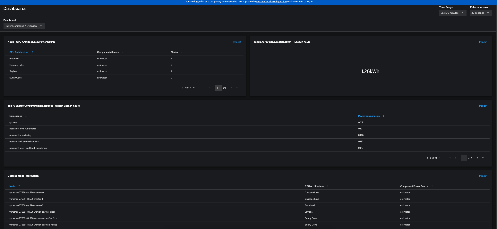
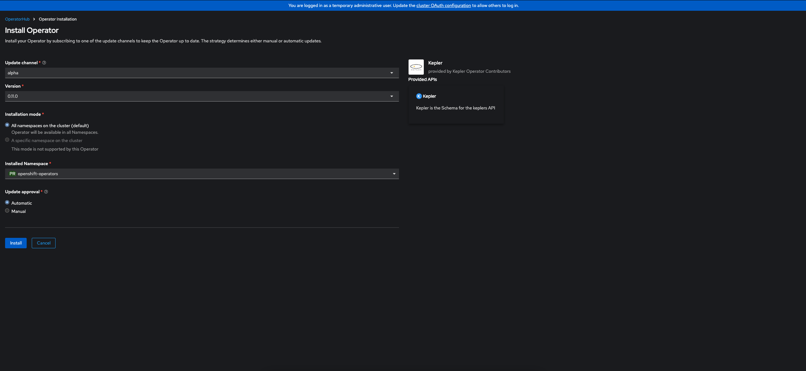
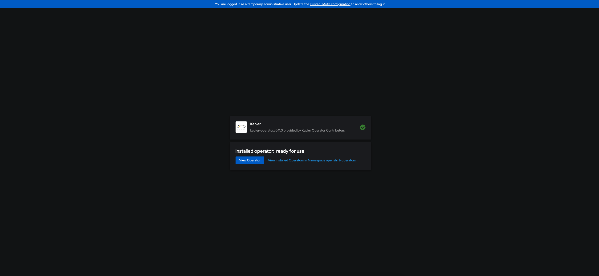

# Kepler 社区 Operator on OpenShift

## 需求

请确定您拥有:

- 一个OCP 4.13集群
- 有`kubeadmin` 或者 `cluster-admin` 权限的用户。
- `oc` 命令.
- 下载了`kepler-operator`[repository](https://github.com/sustainable-computing-io/kepler-operator).
```sh
git clone https://github.com/sustainable-computing-io/kepler-operator.git
cd kepler-exporter
```
---
## 从Operator Hub安装operator

1. 选中Operators > OperatorHub. 搜索 `Kepler`. 点击 `Install`


2. 允许安装


3. 创建Kepler的Custom Resource

> 注意：当前的OCP控制台可能会显示一个JavaScript错误（预计将在4.13.5中修复），但它不会影响其余步骤。修复程序目前可在4.13.0-0.nightly-2023-07-08-165124版本的OCP控制台上获得。

---
## 安装Grafana operator

### 部署Grafana Operator

当前API Bearer令牌需要在`GrafanaDataSource`清单中更新，以便`Grafana DataSource`可以向Prometheus进行身份验证。以下命令将更新清单并在命名空间`kepler-operator-system`中部署Grafana Operator

```sh
BEARER_TOKEN=$(oc whoami --show-token)
hack/dashboard/openshift/deploy-grafana.sh
```
> 注意：脚本要求您位于顶级目录中，因此请确保您位于`kepler-operator`根目录中。使用命令`cd $(git rev-parse --show-toplevel)`

### 访问Garafana Console
配置Networking > Routes.


### Grafana Dashboard
使用密钥`kepler:kepler`登陆Grafana Dashboard.


---

## 故障排除

> 注意：如果数据源出现问题，请检查API令牌是否已正确更新


