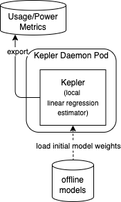
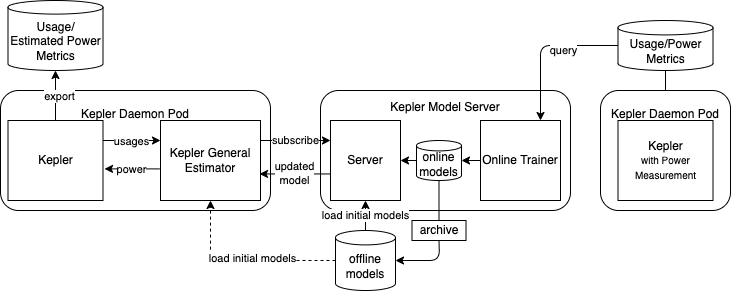

# Kepler 功率估算部署

!!! warning "机器翻译声明"
    本文档由 AI 语言模型 (Claude) 从英文自动翻译而成。如发现翻译错误或不准确之处，请在 [Kepler 文档项目](https://github.com/sustainable-computing-io/kepler-doc/issues) 中提交 issue 报告问题。

在 Kepler 中，我们还为没有安装或支持功率测量工具的系统提供了基于资源使用情况
的功率估算解决方案。有两种估算器替代方案。

## 估算器

- **本地线性回归估算器**：此估算器使用训练的权重乘以使用指标的归一化值来估算
  功率（线性回归模型）。

- **通用估算器 Sidecar**：此估算器转换使用指标并应用训练的模型，这些模型可以是
  来自 scikit-learn 库的任何回归模型或来自 Keras（TensorFlow）的任何神经网络。
  要使用此估算器，需要启用 Kepler 估算器。

除此之外，通过连接 Kepler 模型服务器 API，训练的模型以及权重可以通过在线训练
例程定期更新。

## 部署场景

### 最小部署

最小部署是在 Kepler 主容器中使用本地线性回归估算器，仅使用离线训练的模型权重。

### 使用通用估算器 Sidecar 的部署

要启用通用估算器进行功率推理，可以部署估算器 sidecar，如下图所示。
两个容器之间的连接是轻量级且快速的 unix 域套接字。
与本地估算器不同，通用估算器 sidecar 配备了多个推理支持库和依赖项。
这种额外的开销必须与预期从灵活模型选择中获得的估算准确性提高进行权衡。

### 连接到 Kepler 模型服务器的最小部署

为了获得预期能提供更好估算准确性的更新权重，Kepler 可以连接到远程 Kepler
模型服务器，该服务器使用具有功率测量工具的系统的数据进行在线训练，如下所示。

### 完整部署

下图显示了启用 Kepler 通用估算器并连接到远程 Kepler 模型服务器的部署。
Kepler 通用估算器 sidecar 可以动态从 Kepler 模型服务器更新模型，并期望获得
最准确的模型。

## Kepler 模型数据库中提供的功率模型

版本|功率数据源|管道|可用能源来源|错误报告
---|---|---|---|---
[0.6](https://github.com/sustainable-computing-io/kepler-model-db/tree/main/models/v0.6)|[nx12](https://github.com/sustainable-computing-io/kepler-model-db/tree/main/models/v0.6/nx12)|[std_v0.6](https://github.com/sustainable-computing-io/kepler-model-db/blob/main/models/v0.6/.doc/std_v0.6.md)|rapl,acpi|[链接](https://github.com/sustainable-computing-io/kepler-model-db/blob/main/models/v0.6/nx12/README.md)
[0.7](https://github.com/sustainable-computing-io/kepler-model-db/tree/main/models/v0.7)|[SPECpower](https://www.spec.org/power_ssj2008/)|[specpower](https://github.com/sustainable-computing-io/kepler-model-db/blob/main/models/v0.7/.doc/specpower.md)|acpi|[链接](https://github.com/sustainable-computing-io/kepler-model-db/tree/main/models/v0.7/specpower)
[0.7](https://github.com/sustainable-computing-io/kepler-model-db/tree/main/models/v0.7)|[训练剧本](https://github.com/sustainable-computing-io/kepler-model-training-playbook)|[ec2](https://github.com/sustainable-computing-io/kepler-model-db/blob/main/models/v0.7/.doc/ec2.md)|intel_rapl|[链接](https://github.com/sustainable-computing-io/kepler-model-db/tree/main/models/v0.7/ec2)
