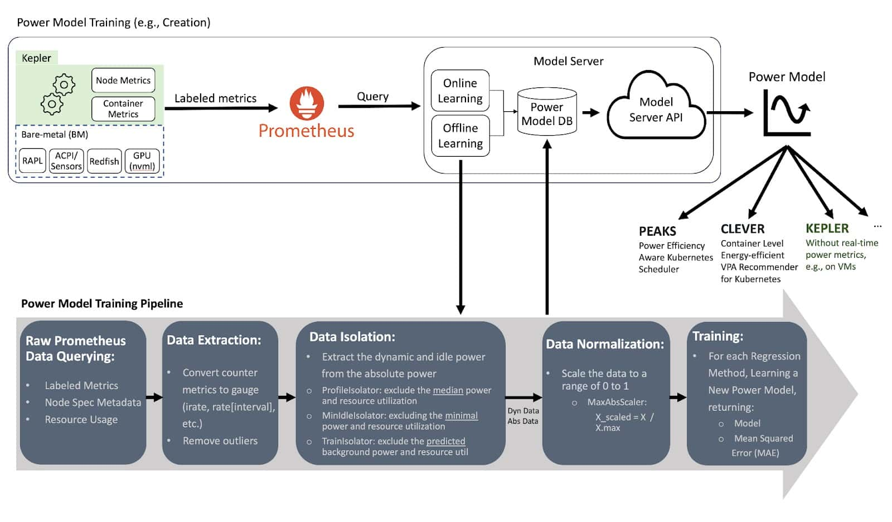
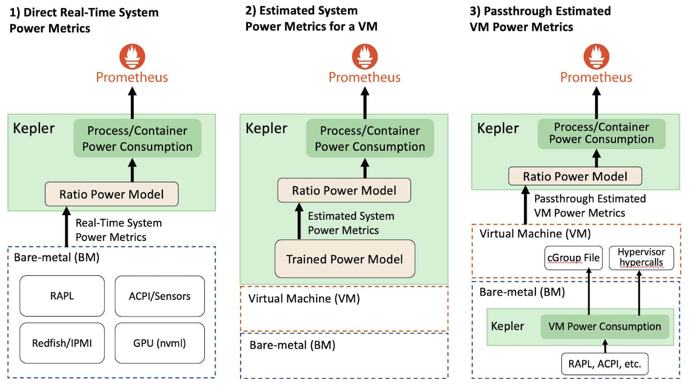

# Kepler 深入探讨

!!! warning "机器翻译声明"
    本文档由 AI 语言模型 (Claude) 从英文自动翻译而成。如发现翻译错误或不准确之处，请在 [Kepler 文档项目](https://github.com/sustainable-computing-io/kepler-doc/issues) 中提交 issue 报告问题。

## Kepler 组件及其功能

Kepler 堆栈包括 Kepler 和 Kepler 模型服务器

### Kepler

Kepler，基于 Kubernetes 的高效功耗级别导出器，提供了一种在进程、容器和
Kubernetes Pod 级别估算功耗的方法。

**Kepler 如何收集数据？**

Kepler 使用以下方式收集功率数据：

#### EBPF、硬件计数器

Kepler 可以利用集成到内核路径中的 BPF 程序来提取与进程相关的资源利用率指标，
或使用来自硬件计数器的指标。用于构建模型的指标类型可能会根据系统环境而有所不同。
例如，它可能使用硬件计数器或来自 eBPF 等工具的指标，具体取决于将使用该模型的
系统中可用的内容。

#### 实时组件功率计

Kepler 还使用各种 API 从节点组件收集实时功耗指标，例如：

- Intel 运行平均功率限制（RAPL）用于 CPU 和 DRAM 功率
- NVIDIA 管理库（NVML）用于 GPU 功率

#### 平台功率计

对于平台功率，即整个节点功率，Kepler 使用：

- 高级配置和电源接口（ACPI）
- Redfish/智能电源管理接口（IPMI）
- 当系统中没有实时功率指标可用时，使用基于回归的训练功率模型。

### Kepler 模型服务器

模型服务器用于训练功率模型，可以选择与 Kepler 一起部署，以帮助 Kepler
为给定环境选择最合适的功率模型。例如，考虑 CPU 型号、可用指标和所需的模型准确性。
***将来，Kepler 也将能够使用模型服务器具有的相同逻辑来选择功率模型。***

模型服务器使用来自特定裸机节点的 Prometheus 指标训练其模型。它记录节点消耗了
多少能量以及容器和系统进程（OS 和其他后台进程）的资源利用率。容器指标是通过
运行各种小测试获得的，这些测试对不同资源（CPU、内存、缓存等）施加压力，
比如使用名为 `stress-ng` 的工具。

在创建功率模型时，模型服务器使用回归算法。它持续训练模型，直到达到可接受的
准确性水平。

训练完成后，模型服务器通过 GitHub 仓库使这些模型可访问，任何 Kepler 部署
都可以从中下载模型。然后 Kepler 使用这些模型根据资源使用方式计算节点（VM）
消耗多少功率。用于构建模型的指标类型可能会根据系统环境而有所不同。例如，
它可能使用硬件计数器或来自 eBPF 等工具的指标，具体取决于将使用该模型的
系统中可用的内容。

有关架构的详细信息，请遵循 Kepler 模型服务器的[文档](https://sustainable-computing.io/kepler_model_server/architecture/)。

### 收集系统功耗 – 虚拟机与裸机

根据部署 Kepler 的环境，系统功耗指标收集会有所不同。例如，考虑下图，
Kepler 可以通过裸机或虚拟机环境部署。

#### 直接实时系统功率指标（裸机）

在允许直接收集实时系统功率指标的裸机环境中，Kepler 可以使用比率功率模型
分配给定系统资源的功耗。公开实时功率指标的 API 导出绝对功率，这是动态功率
和空闲功率的总和。更具体地说，动态功率与资源利用率直接相关，而空闲功率是
恒定功率，无论系统是静止还是有负载都不会变化。此概念很重要，因为空闲功率
和动态功率在所有进程中的分配方式不同。

#### 估算系统功率指标（虚拟机）

在公有云的虚拟机环境中，目前没有直接方法测量虚拟机消耗的功率。因此，
我们需要使用训练的功率模型来估算功率，这有一些影响模型准确性的限制。

Kepler 可以使用训练的功率模型估算虚拟机的动态功耗。然后，在估算每个虚拟机的
功耗后，Kepler 应用比率功率模型来估算进程的功耗。但是，由于虚拟机通常不提供
硬件计数器，Kepler 使用 eBPF 指标而不是硬件计数器来计算比率。重要的是要强调，
用于公有云虚拟机的训练功率模型无法分配资源的空闲功率，因为我们无法知道主机中
运行了多少其他虚拟机。我们在此博客的限制部分提供了更多详细信息。因此，
Kepler 不公开在虚拟机上运行的容器的空闲功率。

功率模型通过对基准测试期间收集的数据执行回归分析（如线性或基于机器学习（ML）
的回归）来训练。这些数据包括裸机节点上的资源利用率和功耗，为功率模型估算
奠定了基础。

#### 透传估算虚拟机功率指标

Kepler 首先部署在裸机节点（即云控制平面）中，使用来自裸机的实时功率指标
持续测量每个虚拟机消耗的动态和空闲功率。然后，Kepler 通过虚拟机公开此功率数据。
这些信息可以通过["虚拟机管理程序超级调用"](https://docs.kernel.org/virt/kvm/x86/hypercalls.html)
或将数字保存在虚拟机可以访问的特殊文件中（例如在虚拟机中挂载的 cGroup 文件）
使虚拟机可用。然后，通过使用虚拟机功耗，虚拟机内的另一个 Kepler 实例可以
应用比率功率模型来估算虚拟机中进程使用的功率。

!!! note
    透传方法仍在探索中，目前在 Kepler 中不可用。

### 比率功率模型解释

如前所述，动态功率与资源利用率直接相关，而空闲功率是恒定功率，无论系统是
静止还是有负载都不会变化。此概念很重要，因为空闲功率和动态功率在所有进程中
的分配方式不同。现在我们可以描述比率功率模型，它将动态功率分配到所有进程中。

比率功率模型计算进程资源利用率与整个系统资源利用率的比率，然后将此比率乘以
资源的动态功耗。这使我们能够根据实际资源利用率准确估算功率使用，确保如果
程序利用 10% 的 CPU，它就消耗 10% 的总 CPU 功率。

空闲功率估算遵循[温室气体（GHG）协议指南](https://www.gesi.org/research/ict-sector-guidance-built-on-the-ghg-protocol-product-life-cycle-accounting-and-reporting-standard)，
该指南规定恒定主机空闲功率应根据进程/容器的大小（相对于主机上运行的其他容器的
总大小）在进程/容器之间分配。此外，重要的是要注意，在 Kepler 中不同的资源
利用率估算方式不同。我们利用硬件计数器评估裸机环境中的资源利用率，使用 CPU
指令估算 CPU 利用率，收集缓存未命中来衡量内存利用率，以及评估流式多处理器
（SM）利用率来衡量 GPU 利用率。

### 功耗归因是如何完成的？

现在我们已经解释了 Kepler 如何收集数据和训练模型以及比率功率模型，让我们
深入了解功耗归因。

一旦收集了与能耗和资源利用率相关的所有数据，Kepler 就可以计算每个进程消耗的
能量。这是通过根据进程和系统资源利用率的比率来分配给定资源使用的功率来完成的。
我们将在此博客后面详细介绍此模型。然后，通过进程的功耗，Kepler 将功率聚合到
容器和 Kubernetes Pod 级别。为容器收集和估算的数据然后由 Prometheus 存储。

Kepler 通过使用在 BPF 程序中收集的进程 ID（PID）信息找到进程属于哪个容器，
然后使用容器 ID，我们可以将其与 Pod 名称关联。更具体地说，容器 ID 来自
`/proc/PID/cgroup`，Kepler 使用 Kubernetes APIServer 保持从节点创建和
删除的 Pod 的更新列表。与 Kubernetes 容器不相关的进程 ID 被分类为
`系统进程`（包括 PID 0）。

***将来，运行虚拟机的进程将与虚拟机 ID 关联，以便 Kepler 也可以导出虚拟机指标。***

### 预训练功率模型限制

重要的是要注意，与使用实时功率指标的功率模型相比，预训练功率模型有其限制。

- **系统特定模型：** 预训练功率模型是系统特定的，根据 CPU 型号和架构而有所不同。
虽然不完美，但通用模型可以提供应用程序功耗的见解，有助于节能决策。

- **虚拟机功耗高估：** 将裸机功率模型用于单个虚拟机可能导致高估，因为这些模型
可能不反映多个虚拟机共享节点时的实际功耗。当使用更多 CPU 时，功率曲线可能
显示功耗降低，影响准确估算。

- **空闲功率分配挑战：** 在公有云环境中，根据虚拟机相对于主机上其他虚拟机的
大小在虚拟机之间分配空闲功率是具有挑战性的，因为无法确定主机上同时运行的
虚拟机数量。由于此限制，准确估算每个虚拟机的空闲功率变得复杂。

- **对虚拟机管理程序报告的依赖：** 虚拟机的预训练功率模型依赖于虚拟机管理程序
对 CPU 寄存器值的准确报告。某些公有云虚拟机中资源的过度配置可能影响资源
利用率指标的准确性，影响这些功率模型的可靠性。

!!! note
    有关预训练功率模型限制的更详细解释，请阅读 Kepler 维护者的
    [博客](https://www.cncf.io/blog/2023/10/11/exploring-keplers-potentials-unveiling-cloud-application-power-consumption/)。

- [ ] 解释[模型](https://github.com/sustainable-computing-io/kepler-model-server/tree/main/tests/test_models)。模型有何不同，何时应用特定模型而不是另一个模型是否有正确的用例/场景？
- [ ] AbsComponentModelWeight
- [ ] AbsComponentPower
- [ ] AbsModelWeight
- [ ] AbsPower
- [ ] DynComponentModelWeight
- [ ] DynComponentPower
- [ ] XGBoost
