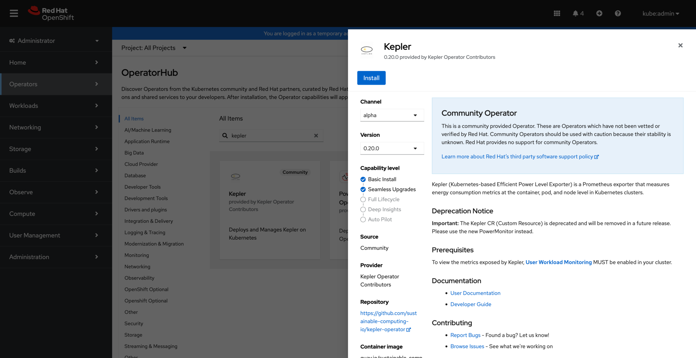
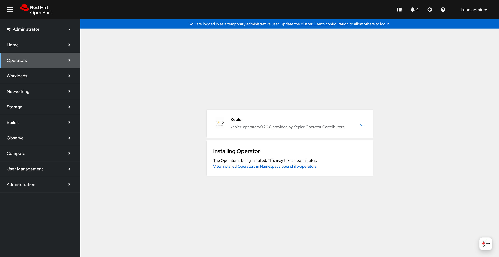
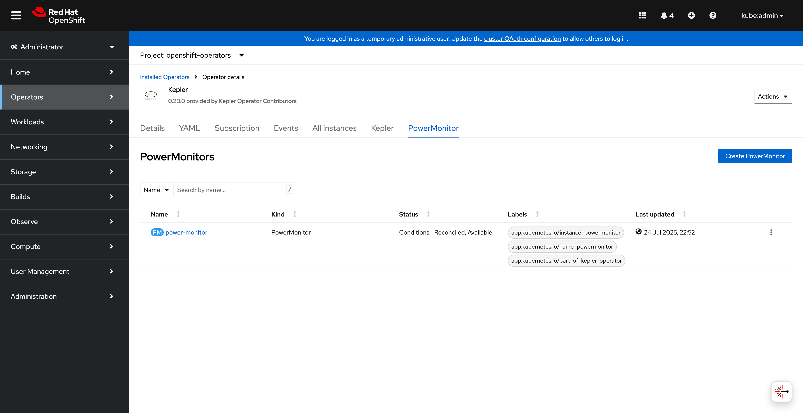
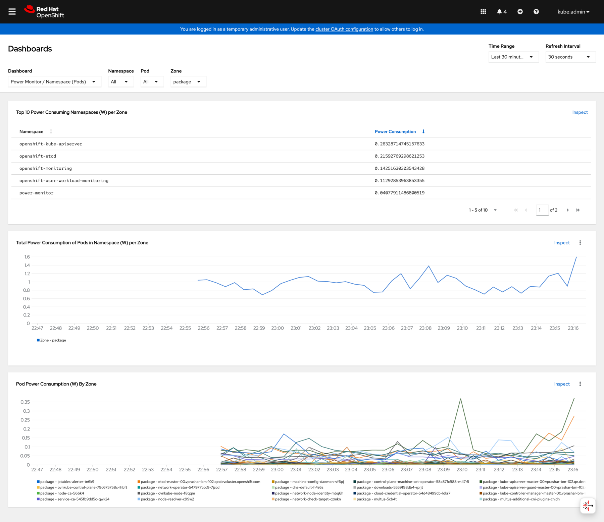

# 快速入门指南：OpenShift OperatorHub

!!! warning "机器翻译声明"
    本文档由 AI 语言模型 (Claude) 从英文自动翻译而成。如发现翻译错误或不准确之处，请在 [Kepler 文档项目](https://github.com/sustainable-computing-io/kepler-doc/issues) 中提交 issue 报告问题。

本指南将指导您使用 OpenShift Web 控制台安装 Kepler Operator 并创建您的第一个 PowerMonitor 实例。

## 步骤 1：安装 Operator

### 访问 OperatorHub

在 OpenShift Web 控制台中导航到 **Operators** → **OperatorHub** 并搜索 "kepler"：


*OperatorHub 中可用的 Kepler operator*

### 开始安装

点击 **Install** 开始安装过程：


*开始 Kepler operator 安装*

### 监控进度

在控制台中观察安装进度：


*Operator 安装正在进行中*

### 验证安装

安装成功完成后：


*Operator 成功安装并准备使用*

## 步骤 2：创建 PowerMonitor 实例

### 访问 Operator 详情

导航到 operator 详情以查看可用的 API：


*Kepler operator 详情显示 PowerMonitor 和已弃用的 Kepler API*

### 打开 PowerMonitor 选项卡

点击 **PowerMonitor** 选项卡以访问现代 API：


*operator 详情中的 PowerMonitor API 选项卡*

### 创建 PowerMonitor

点击 **Create PowerMonitor** 打开 YAML 编辑器：


*OpenShift 编辑器中的 PowerMonitor YAML 配置*

使用此基本配置：

```yaml
apiVersion: kepler.system.sustainable.computing.io/v1alpha1
kind: PowerMonitor
metadata:
  name: power-monitor
  labels:
    app.kubernetes.io/name: powermonitor
    app.kubernetes.io/instance: powermonitor
    app.kubernetes.io/part-of: kepler-operator
spec:
  kepler:
    config:
      logLevel: info
      metricLevels:
      - node
      - pod
      - vm
      sampleRate: 5s
      staleness: 500ms
      maxTerminated: 500
    deployment:
      security:
        mode: none
```

## 步骤 3：验证部署

### 检查 PowerMonitor 状态

查看 PowerMonitor 实例详情和状态：


*PowerMonitor 实例详情和状态条件*

### 验证 DaemonSet

检查 DaemonSet 是否在您的节点上运行：

```bash
oc get powermonitor power-monitor -o wide
oc get daemonset -n power-monitor
oc get pods -n power-monitor -o wide
```

## 步骤 4：访问指标

### OpenShift 指标控制台

在 OpenShift 控制台中导航到 **Observe** → **Metrics**：


*显示功耗概览的 OpenShift 指标仪表板*

### 查看功率指标

探索详细的功耗指标：


*详细的 OpenShift 指标仪表板，包含功耗图表和节点信息*

## 后续步骤

现在您已经运行了 Kepler，请探索这些指南：

- **[配置指南](../configuration/index.zh.md)** - 自定义您的部署
- **[监控设置](../configuration/monitoring-troubleshooting.zh.md)** - 高级监控和 Grafana
- **[故障排除](../configuration/monitoring-troubleshooting.zh.md#troubleshooting)** - 常见问题和解决方案

## 快速参考

### 常用命令

```bash
# 检查 PowerMonitor 状态
oc get powermonitor power-monitor

# 查看 operator 日志
oc logs -n openshift-operators deployment/kepler-operator-controller-manager

# 检查 Kepler pod 日志
oc logs -n power-monitor -l app.kubernetes.io/name=kepler-exporter

# 测试指标端点
oc port-forward -n power-monitor svc/kepler-exporter 9102:9102
curl http://localhost:9102/metrics
```
