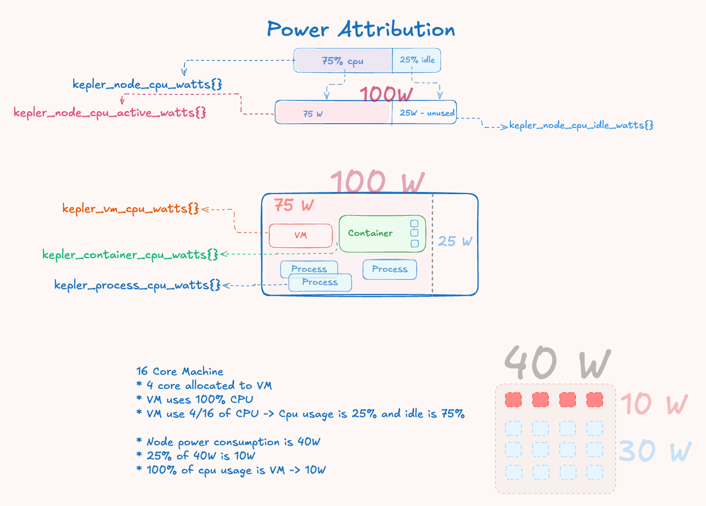

# 理解 Kepler 功率归因

!!! warning "机器翻译声明"
    本文档由 AI 语言模型 (Claude) 从英文自动翻译而成。如发现翻译错误或不准确之处，请在 [Kepler 文档项目](https://github.com/sustainable-computing-io/kepler-doc/issues) 中提交 issue 报告问题。

本指南解释了 Kepler 如何测量和归因功率消耗到
在您系统上运行的进程、容器、虚拟机和 Pod。

## 功率归因的工作原理

### 全局视图

现代系统缺乏按工作负载的能耗计量，仅在硬件级别提供聚合
功耗。Kepler 通过基于资源利用率的比例分配来解决这一归因
挑战：

1. **硬件能耗收集** - Intel RAPL 传感器在封装、内核、DRAM 和非内核级别提供累积
   能量计数器
2. **系统活动分析** - 来自 `/proc/stat` 的 CPU 利用率指标
   确定活动与空闲系统操作的比率
3. **功率域分离** - 总能量分为活动功率
   （与工作负载活动成正比）和空闲功率（基线消耗）
4. **比例归因** - 活动功率根据工作负载的 CPU 时间消耗比率分配给工作负载

### 核心理念

Kepler 实现了一个**基于 CPU 时间比例的能量归因模型**，该模型
根据各个工作负载的计算资源使用模式将硬件测量的能耗分配给它们。

基本原理认识到系统功耗有两个
不同的组成部分：

- **活动功率**：计算工作消耗的能量，与 CPU 利用率成正比并随工作负载活动可扩展
- **空闲功率**：维持系统运行的固定基线能量，
  包括内存刷新、时钟分配和空闲内核功率状态

### 归因公式

所有工作负载类型使用相同的比例归因公式：

```text
工作负载功率 = (工作负载 CPU 时间 Δ / 节点 CPU 时间 Δ) × 活动功率
```

这确保了能量守恒 - 归因功率的总和保持
与测量的硬件消耗成正比，同时基于实际资源利用率保持公平性。



*图 1：功率归因流程，显示总测量功率如何
分解为活动和空闲组件，活动功率根据工作负载 CPU 时间增量按比例分配。*

## 理解能量与功率

- **能量**：以微焦耳 (μJ) 为单位测量，作为来自硬件的累积计数器
- **功率**：使用 `功率 = ΔEnergy / Δtime` 计算为微瓦 (μW) 的速率

## 能量区域

硬件能量从不同区域读取：

- **Package**：CPU 封装级能耗
- **Core**：单个 CPU 内核能量
- **DRAM**：内存子系统能量
- **Uncore**：集成显卡和其他非内核组件
- **PSys**：平台级能量（可用时最全面）

## 归因示例

### 示例 1：基本功率分配

**系统状态：**

- 硬件报告：40W 总系统功率
- 节点 CPU 使用率：25% 利用率
- 功率分配：40W × 25% = 10W 活动，30W 空闲

**工作负载归因：**
如果一个容器在测量间隔内使用了总节点 CPU 时间的 20%：

- **容器功率** = (20% CPU 使用率) × 10W 活动 = 2W

### 示例 2：多工作负载场景

**系统状态：**

- 总功率：60W
- CPU 使用率：33.3% (1/3)
- 活动功率：20W，空闲功率：40W
- 节点总 CPU 时间：1000ms

**进程级 CPU 使用率：**

- 进程 1（独立）：100ms CPU 时间
- 进程 2（在容器-A 中）：80ms CPU 时间
- 进程 3（在容器-A 中）：70ms CPU 时间
- 进程 4（在容器-B 中）：60ms CPU 时间
- 进程 5（QEMU 虚拟机管理程序）：200ms CPU 时间
- 进程 6（在容器-C，Pod-X 中）：90ms CPU 时间
- 进程 7（在容器-D，Pod-X 中）：110ms CPU 时间

**分层 CPU 时间聚合：**

- 容器-A CPU 时间：80ms + 70ms = 150ms
- 容器-B CPU 时间：60ms
- 容器-C CPU 时间：90ms（Pod-X 的一部分）
- 容器-D CPU 时间：110ms（Pod-X 的一部分）
- Pod-X CPU 时间：90ms + 110ms = 200ms
- 虚拟机 CPU 时间：200ms（QEMU 虚拟机管理程序进程）

**独立功率归因（每个都来自节点活动功率）：**

- 进程 1：(100ms / 1000ms) × 20W = 2W
- 容器-A：(150ms / 1000ms) × 20W = 3W
- 容器-B：(60ms / 1000ms) × 20W = 1.2W
- Pod-X：(200ms / 1000ms) × 20W = 4W
- 虚拟机：(200ms / 1000ms) × 20W = 4W

**注意：** 每种工作负载类型根据自己的 CPU 时间独立地从节点活动功率计算功率，而不是从构成工作负载继承。

### 示例 3：具有多个进程的容器

**容器 "web-server"：**

- 进程 1（nginx）：100ms CPU 时间
- 进程 2（worker）：50ms CPU 时间
- 容器总计：150ms CPU 时间

**如果节点总 CPU 时间为 1000ms：**

- 容器 CPU 比率：150ms / 1000ms = 15%
- 容器功率：15% × 活动功率

### 示例 4：具有多个容器的 Pod

**Pod "frontend"：**

- 容器 1（nginx）：200ms CPU 时间
- 容器 2（sidecar）：50ms CPU 时间
- Pod 总计：250ms CPU 时间

**如果节点总 CPU 时间为 1000ms：**

- Pod CPU 比率：250ms / 1000ms = 25%
- Pod 功率：25% × 活动功率

## 限制和注意事项

### CPU 归因效果良好的情况

- **CPU 密集型工作负载**，具有相似的指令组合
- **稳态工作负载**，没有显著的频率缩放
- **相对比较**，在相似工作负载类型之间
- **趋势分析**，在较长时间段内

### 需要谨慎的情况

- **混合工作负载环境**，具有不同的计算与 I/O 模式
- **高性能计算**工作负载使用专用指令
- **绝对功率预算**决策仅基于 Kepler 指标
- **细粒度优化**需要精确的每进程功率测量

### 工作负载特定特征

#### 计算与内存密集型工作负载

```text
示例场景：
- 进程 A：50% CPU，计算密集型（高频率，活跃执行）
- 进程 B：50% CPU，内存密集型（频繁停顿，较低频率）

当前归因：两者都接收相等的功率
实际情况：进程 A 可能消耗 2-3 倍更多功率
```

#### CPU 功率状态影响

现代 CPU 实现复杂的功率管理，影响归因准确性：

- **C 状态（CPU 睡眠状态）**：不同的睡眠行为影响功耗
- **P 状态（性能状态）**：动态频率缩放影响每 CPU 周期的功率
- **指令级变化**：向量指令比标量操作消耗更多功率

### 超越 CPU 归因

#### 内存和 I/O 考虑

- **DRAM 功率**：内存密集型工作负载消耗更多 DRAM 功率
- **存储 I/O**：触发存储控制器和设备功率
- **网络 I/O**：消耗网络接口和 PCIe 功率
- **GPU 工作负载**：集成显卡功率未被 CPU 指标捕获

## 关键指标

- `kepler_node_cpu_watts{}`：总节点功耗
- `kepler_process_cpu_watts{}`：单个进程功率
- `kepler_container_cpu_watts{}`：容器级功率
- `kepler_vm_cpu_watts{}`：虚拟机功率
- `kepler_pod_cpu_watts{}`：Kubernetes Pod 功率

## 结论

Kepler 的功率归因系统为单个工作负载提供实用的、成比例的硬件能耗分配。虽然基于 CPU 时间的归因由于现代 CPU 复杂性而具有固有限制，但它为大多数监控和优化用例在准确性、简单性和性能开销之间提供了良好的平衡。

理解能力和限制有助于用户就何时以及如何依赖 Kepler 的功率归因指标做出明智决策。
